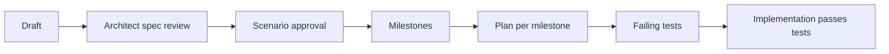

# Workflow diagram

**Status: planned; the engine does not implement this yet.**

This mirrors the intended flow described in `docs/features/README.md` and `../README.md`: a feature spec folder is drafted, reviewed by the architect, its scenarios approved, then split into milestones. Each milestone becomes one Forge plan whose first stage writes failing tests from that milestone's scenarios, and whose later stages implement the feature until those tests pass.
